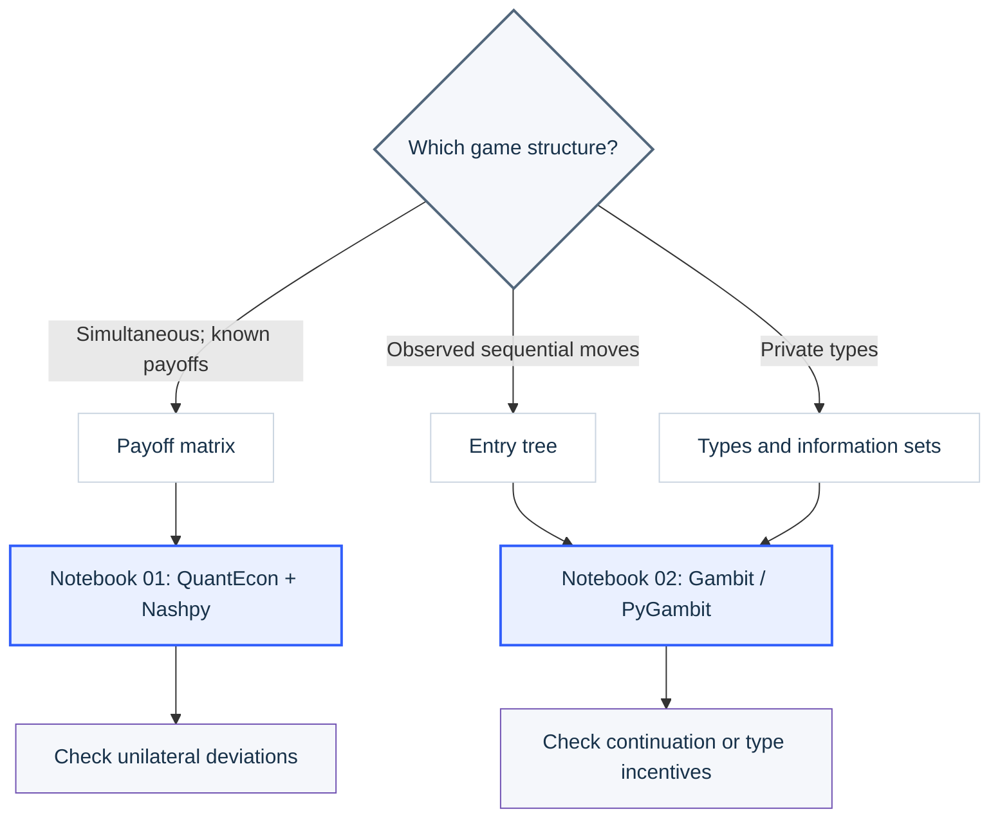
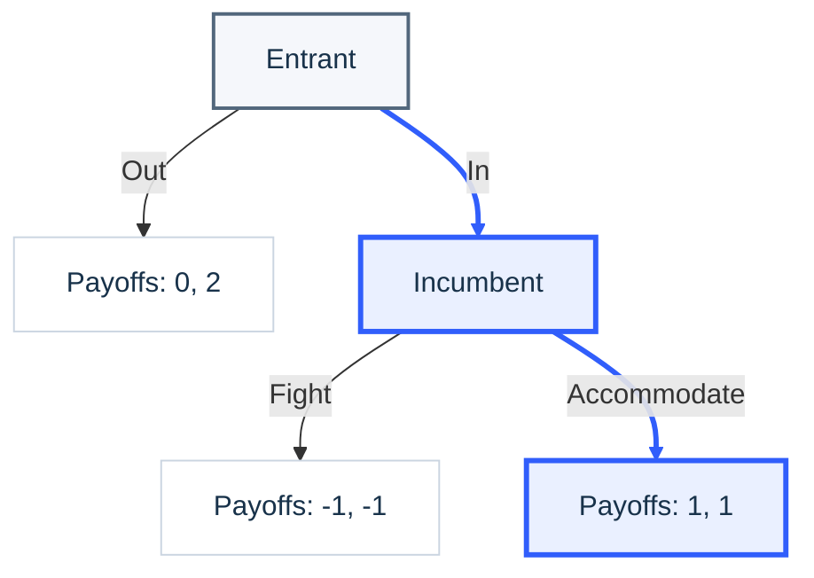
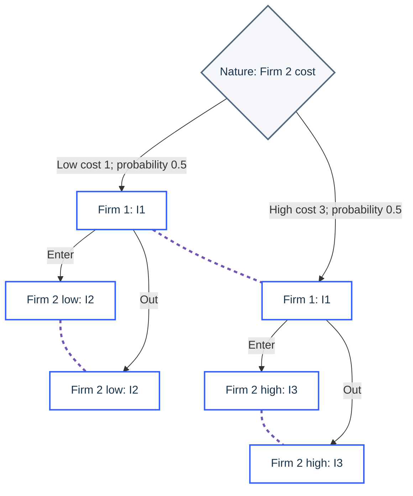

<a id="top"></a>
<div align="center">

# Game Theory Tools

### From Nash, Selten, and Harsanyi to Social Choice and Mechanism Design

**COMSCI/ECON 206 · Computational Microeconomics**<br>
Duke Kunshan University · Autumn 2026 · **Prof. Luyao Zhang**

**Construct the game → choose the solution concept → test the contribution → redesign the institution.**

[](https://github.com/sunshineluyao/gt-tools-demos/actions/workflows/notebooks.yml)
[](docs/01_Matrix_Games_Demo.md)
[](docs/02_Trees_and_Information_Demo.md)
[](https://colab.research.google.com/github/sunshineluyao/gt-tools-demos/blob/main/notebooks/quantecon_nashpy/01_QuantEcon_Nashpy_Interactive.ipynb)
[](https://colab.research.google.com/github/sunshineluyao/gt-tools-demos/blob/main/notebooks/gambit_pygambit/02_Gambit_PyGambit_Interactive.ipynb)
[](https://github.com/sunshineluyao/gt-tools-demos/archive/refs/heads/main.zip)

[Open auction Colab](https://colab.research.google.com/github/sunshineluyao/gt-tools-demos/blob/main/notebooks/auctions/04_Auction_Design_Three_Lenses.ipynb) · [Launch the live Three-Lens Studio](https://gt-tools-demos-sigma.vercel.app/) · [Deploy your own copy](https://vercel.com/new/clone?repository-url=https%3A%2F%2Fgithub.com%2Fsunshineluyao%2Fgt-tools-demos)

</div>


This repository is a guided learning environment for turning a research idea into observable evidence of **Strategic Thinking**, **Interdisciplinary Contribution**, and **Mechanism Design**. Students first formalize strategic interaction, then test a literature contribution, and finally compare how game theory, social choice, and mechanism design change the same problem.

> [!NOTE]
> **Release scope.** Notebooks 01 and 02 are the Week 3 game-theory foundations. Notebook 03 is the Week 4 school-choice transfer. Notebook 04 and the auction module in the Three-Lens Studio are the Week 5 application: classify → solve → evaluate → stress-test → govern.

## Navigation

**Start**

- [Quick start: choose your route](#quick-start)
- [Learning path and student evidence](#learning-path)

**Learn and teach**

- [Three-Lens Studio](#three-lens-studio)
- [Notebook sequence](#notebooks)
- [Choose the model and tool](#choose-a-tool)
- [Core concept cards](#game-cards)
- [Classroom use](#classroom-use)

**Build, verify, and cite**

- [Local use and Vercel deployment](#local-and-vercel)
- [Validation and evidence boundaries](#validation)
- [Repository map](#repository-map)
- [References, software, and licenses](#software-and-licenses)

<a id="quick-start"></a>
## 1. Quick start: choose your route

| I want to… | Start here | What I should produce |
|---|---|---|
| Complete the Wednesday self-check | [Three-Lens Studio source](web/) and [school-choice Colab](https://colab.research.google.com/github/sunshineluyao/gt-tools-demos/blob/main/notebooks/school_choice/03_School_Choice_Three_Perspectives.ipynb) | A valid game, a literature comparison, and a three-lens explanation |
| Learn simultaneous-move games | [Notebook 01 teaching page](docs/01_Matrix_Games_Demo.md) → [Colab 01](https://colab.research.google.com/github/sunshineluyao/gt-tools-demos/blob/main/notebooks/quantecon_nashpy/01_QuantEcon_Nashpy_Interactive.ipynb) | A payoff matrix and unilateral-deviation check |
| Learn sequential or incomplete-information games | [Notebook 02 teaching page](docs/02_Trees_and_Information_Demo.md) → [Colab 02](https://colab.research.google.com/github/sunshineluyao/gt-tools-demos/blob/main/notebooks/gambit_pygambit/02_Gambit_PyGambit_Interactive.ipynb) | A game tree, information structure, and credibility or type-incentive check |
| Compare social goals and allocation rules | [School-choice Colab 03](https://colab.research.google.com/github/sunshineluyao/gt-tools-demos/blob/main/notebooks/school_choice/03_School_Choice_Three_Perspectives.ipynb) | Boston and deferred-acceptance traces, plus stability and manipulation analysis |
| Apply game theory to auctions | [Auction teaching page](docs/04_Auction_Design_Demo.md) → [Colab 04](https://colab.research.google.com/github/sunshineluyao/gt-tools-demos/blob/main/notebooks/auctions/04_Auction_Design_Three_Lenses.ipynb) | Format classification, equilibrium checks, revenue equivalence, objective dashboard, and institutional stress tests |
| Teach the laboratory | [Classroom guide](docs/Wednesday_UI_Demo.md) and [ready-to-open games](examples/) | A paced demonstration, peer challenge, and exit ticket |
| Run or deploy the website | [Local/Vercel instructions](#local-and-vercel) | A tested static build in `dist/` |

**Recommended student sequence:** read the relevant teaching page, predict the result before running code, run the Colab notebook, change one assumption, and explain what changed and why.

[Back to top](#top)

<a id="learning-path"></a>
## 2. Learning path: what students must demonstrate

| Stage | Guiding question | Required action | Observable evidence |
|---|---|---|---|
| **1 · Strategic Thinking** | What is the simplest valid representation of my problem? | Specify at least two players and two distinct feasible strategies per player; use a matrix or tree; state payoffs, timing, and information | Game card, equilibrium check, modeling boundary, and condition that could overturn the conclusion |
| **2 · Interdisciplinary Contribution** | Does my claimed gap survive comparison with close literature? | Compare research question, economic model, computational method, behavioral evidence, application, validation, and synthesis | Verified literature matrix; abstract sentence two beginning with **However** or **Yet**; revised contribution claim; AI-use disclosure |
| **3 · Three Connected Lenses** | How does each intellectual perspective change the problem? | Speak as a game theorist, social-choice researcher, and mechanism designer | Strategic prediction; explicit collective objective and trade-off; redesigned rule with truthfulness, stability, efficiency, or fairness test |
| **4 · Capstone Transfer** | What must the team keep, revise, or investigate next? | Transfer the diagnostics to the shared research question and future-research roadmap | A documented **Keep / Revise / Investigate** decision and the next verification step |

The lenses are cumulative rather than interchangeable. **Game theory** predicts behavior under given rules. **Social choice** states and compares collective goals. **Mechanism design** changes the rules and asks whether the desired outcomes can be implemented under strategic behavior.

[Back to top](#top)

<a id="three-lens-studio"></a>
## 3. Three-Lens Studio

The static browser tutorial converts the learning path into three practical modules:

| Module | Student task | Built-in check |
|---|---|---|
| **A · Strategic Thinking** | Enter players, strategies, timing, and information; construct the smallest intuitive example | Rejects fewer than two players or two strategies and guides the student toward Nash, Selten, or Harsanyi |
| **B · Interdisciplinary Contribution** | Draft the literature-gap pivot and compare the closest papers dimension by dimension | Requires **However** or **Yet**, generates a counterexample-search prompt, and labels AI suggestions **UNVERIFIED** until a human checks the sources |
| **C · Three Perspectives** | Compare Boston and student-proposing deferred acceptance through three disciplinary personas | Animates proposal → decision → continuation, names who exits or remains active, and checks manipulation and blocking pairs |

The Week 5 **Auction Design Lab** is the fourth applied module. It maps first-price, second-price, English, Dutch, and all-pay auctions to BNE, DSIC, or PBE; executes allocation and payment rules; visualizes utility and objective metrics; verifies revenue equivalence with seeded simulation; and stress-tests bounded behavior, risk, common values, resale, collusion, and seller credibility.

### School-choice mechanism at a glance

Let $U$ be students still seeking a seat, $P_s^r$ the round-$r$ proposals to school $s$, $H_s^r$ its current holds, and $q_s$ its capacity.

| Phase | Boston / immediate acceptance | Gale–Shapley / student-proposing deferred acceptance |
|---|---|---|
| ⚙️ **Initialize** | $U\leftarrow N$; all seats open | $U\leftarrow N$ and $H_s^0\leftarrow\varnothing$ |
| → **Propose** | Every $i\in U$ applies to rank $r$ | Every rejected $i\in U$ proposes to the next untried school |
| 🏫 **Decide** | Permanently accept the highest-priority students in $P_s^r$ up to remaining capacity | From $H_s^{r-1}\cup P_s^r$, tentatively hold the top $q_s$ students and release the rest |
| ↺ **Continue** | Accepted students exit; rejected students try rank $r+1$ | Rejected or displaced students continue; held students can still be displaced |
| 🏁 **Finalize** | Each acceptance is final immediately | All holds become final only when no proposal remains |

**Difference to remember:** Boston locks a seat now; deferred acceptance keeps the seat contestable until proposals stop. The [school-choice notebook](notebooks/school_choice/03_School_Choice_Three_Perspectives.ipynb) shows the exact baseline trace and lets students move one school to the top of one submitted ranking.

### Human-first protocol

1. Formulate the problem independently.
2. Exchange a peer challenge.
3. Use generative AI only to search for counterexamples or close literature.
4. Open and verify every cited source yourself.
5. Revise the claim and disclose how AI was used.

The studio stores no form data, uses no API key, and sends no student response to a server. Form content remains in the browser and disappears on refresh.

**Launch options:** [inspect the studio source](web/) · [deploy a copy on Vercel](https://vercel.com/new/clone?repository-url=https%3A%2F%2Fgithub.com%2Fsunshineluyao%2Fgt-tools-demos) · [read the deployment guide](docs/DEPLOY_VERCEL.md)

[Back to top](#top)

<a id="teach-directly-from-github"></a>
<a id="notebooks"></a>
## 4. Notebook sequence

| Order | Notebook | Model and tools | Change one assumption | Independent check |
|---:|---|---|---|---|
| **01** | [QuantEcon + Nashpy](notebooks/quantecon_nashpy/01_QuantEcon_Nashpy_Interactive.ipynb) | Static, complete-information 2×2 games | Change any of the eight payoffs or select a preset | Both tools agree; unilateral deviation gains are tested |
| **02** | [Gambit / PyGambit](notebooks/gambit_pygambit/02_Gambit_PyGambit_Interactive.ipynb) | Matrix → sequential entry → private-cost entry | Change threat credibility, entry payoffs, prior, or costs | Pure Nash, backward-induction SPNE, and type-conditional Bayesian incentives are checked |
| **03** | [School choice](notebooks/school_choice/03_School_Choice_Three_Perspectives.ipynb) | Boston and Gale–Shapley student-proposing deferred acceptance | Move one school to the top of one student's ranking, then switch mechanisms | Proposal/decision/continuation trace, blocking pairs, and a Boston manipulation counterexample |
| **04** | [Auction design](notebooks/auctions/04_Auction_Design_Three_Lenses.ipynb) | Five auction formats from BNE/DSIC/PBE to credible deployment | Change one assumption: risk, behavior, common value, reserve, budget, resale, collusion, or trust | Expected-best-response, dominant-strategy, revenue-equivalence, objective, and institutional checks |

### Run in Google Colab

1. Open the appropriate Colab link below and select **File → Save a copy in Drive** if you want to keep edits.
2. Use a **CPU** runtime. Run the setup cell before imports, then choose **Runtime → Run all**.
3. Predict before changing a parameter. Record the baseline, one changed input, the new output, and your explanation.
4. If a widget does not render, rerun its cell or use the ordinary Python function shown beside it. Notebook 02 may take several minutes to compile PyGambit on its first setup.

<!-- COLAB_LINKS_START -->
Direct Colab links (check student access after uploading the repository):

- [01_QuantEcon_Nashpy_Interactive](https://colab.research.google.com/github/sunshineluyao/gt-tools-demos/blob/main/notebooks/quantecon_nashpy/01_QuantEcon_Nashpy_Interactive.ipynb)
- [02_Gambit_PyGambit_Interactive](https://colab.research.google.com/github/sunshineluyao/gt-tools-demos/blob/main/notebooks/gambit_pygambit/02_Gambit_PyGambit_Interactive.ipynb)
- [03_School_Choice_Three_Perspectives](https://colab.research.google.com/github/sunshineluyao/gt-tools-demos/blob/main/notebooks/school_choice/03_School_Choice_Three_Perspectives.ipynb)
- [04_Auction_Design_Three_Lenses](https://colab.research.google.com/github/sunshineluyao/gt-tools-demos/blob/main/notebooks/auctions/04_Auction_Design_Three_Lenses.ipynb)
<!-- COLAB_LINKS_END -->

[Back to top](#top)

<a id="choose-a-tool"></a>
## 5. Choose the model before the software



| Timing × information | Representation | Concept and software |
|---|---|---|
| Static + complete | Payoff matrix | Nash equilibrium; Nashpy for transparent two-player calculations and QuantEcon for broader computational economics |
| Dynamic + complete | Tree with observed moves | SPNE; PyGambit represents the game, while backward induction checks continuation optimality |
| Static + incomplete | Types, common prior, and information sets | Bayesian Nash equilibrium; PyGambit plus direct expected-payoff checks |
| Dynamic + incomplete | Histories, types, beliefs, and information sets | Later refinements; representing the tree does not by itself select the appropriate equilibrium refinement |

> [!IMPORTANT]
> A **tree is a representation**, not evidence that moves are observed. Complete information concerns knowledge of payoff structure; perfect information concerns observation of prior moves. The private-cost entry tree below uses information sets to preserve hidden information and simultaneous decisions.

For graphical editing, use the [Gambit / Game Theory Explorer classroom guide](docs/Wednesday_UI_Demo.md).

[Back to top](#top)

<a id="game-cards"></a>
## 6. Core concept cards

These compact examples support the diagnostic. Full tables, derivations, parameter changes, and saved outputs are on the [matrix teaching page](docs/01_Matrix_Games_Demo.md) and [trees-and-types teaching page](docs/02_Trees_and_Information_Demo.md).

<details>
<summary><strong>Nash · Can either player gain by deviating alone?</strong></summary>

The row player chooses a row and the column player chooses a column. Each cell reports **(row payoff, column payoff)**.

| Row / Column | Cooperate | Defect |
|---|---:|---:|
| Cooperate | (3, 3) | (0, 5) |
| Defect | (5, 0) | (1, 1) |

With `A = [[3, 0], [5, 1]]` and `B = [[3, 5], [0, 1]]`, a Nash equilibrium $(x^{\star},y^{\star})$ satisfies

$$
(x^{\star})^{\mathsf T}Ay^{\star}\geq x^{\mathsf T}Ay^{\star},
\qquad
(x^{\star})^{\mathsf T}By^{\star}\geq(x^{\star})^{\mathsf T}By.
$$

**Baseline:** both defect, so the strategies are $(0,1)$ and $(0,1)$ and payoffs are $(1,1)$.

</details>

<details>
<summary><strong>Selten · Is every continuation credible?</strong></summary>



Pure Nash profiles are (Out, Fight) and (In, Accommodate). Backward induction removes the non-credible Fight threat because the incumbent prefers 1 to −1 after entry. The baseline SPNE is therefore **(In, Accommodate)**.

</details>

<details>
<summary><strong>Harsanyi · What does each player know?</strong></summary>



Dashed links are information sets, not actions. Firm 1 does not observe Firm 2’s cost; Firm 2 knows its own type. With equal type probabilities, the baseline Bayesian equilibrium is

$$
\mathrm{BNE}=(\mathrm{Enter};\mathrm{Enter}\text{ if low},\mathrm{Out}\text{ if high}).
$$

</details>

[Back to top](#top)

<a id="classroom-use"></a>
## 7. Classroom use

| Before class | During class | After class |
|---|---|---|
| Open each Colab once, run all cells, and preflight Gambit/GTE links | Ask students to predict before computation, change one input, and explain the mechanism behind the change | Save a copy, record evidence, and transfer one result into the project’s Keep/Revise/Investigate log |

- [Wednesday classroom guide](docs/Wednesday_UI_Demo.md): paced interface demonstration, practice sequence, and exit ticket.
- [`examples/`](examples/): ready-to-open `.nfg` and `.efg` games for Gambit desktop.
- [Gambit official site](https://www.gambit-project.org/): install the desktop application separately; the `pygambit` package does not install the graphical interface.
- [Game Theory Explorer](http://www.gametheoryexplorer.org/): optional graphical builder. Its live operation was not verified in this release, so preflight it before class and retain Gambit as the fallback.

[Back to top](#top)

<a id="local-and-vercel"></a>
## 8. Local use and Vercel deployment

### Static Three-Lens Studio

Node.js 20 or later is sufficient. The site has no runtime dependency, API key, database, or environment variable.

```bash
npm test
npm run build
python -m http.server 4173 --directory dist
```

Open `http://localhost:4173`. The build copies the reviewed files from `web/` into `dist/`. The live deployment is [gt-tools-demos-sigma.vercel.app](https://gt-tools-demos-sigma.vercel.app/); it updates after the verified main-branch commit is pushed.

For Vercel Git import, keep the repository root as `./`, select **Other**, use `npm run build`, and publish `dist/`. The repository’s [`vercel.json`](vercel.json) already provides these settings. See the [step-by-step deployment and browser preflight](docs/DEPLOY_VERCEL.md).

### Python notebooks and tests

Python 3.12 was used for the release checks.

```bash
python -m venv .venv
source .venv/bin/activate
python -m pip install -r requirements.txt
python -m pip install -r requirements-dev.txt
python -m unittest discover -s tests -v
```

Linux requires a C++ compiler for PyGambit. See [`docs/SETUP.md`](docs/SETUP.md) for the documented GNU-tool configuration and notebook-specific guidance.

[Back to top](#top)

<a id="validation"></a>
## 9. Validation and evidence boundaries

| Layer | What is checked | Evidence |
|---|---|---|
| Economic and algorithmic models | Payoff orientation, off-path credibility, type incentives, auction allocation/payments, revenue equivalence, winner's curse, resale, collusion, seller credibility, matching stability, and Boston manipulation | [`outputs/model_tests.txt`](outputs/model_tests.txt) and [`outputs/validation.json`](outputs/validation.json) |
| Notebooks | Complete execution, saved outputs, valid notebook structure, and saved matching animations | [`outputs/`](outputs/) execution records |
| Markdown and mathematics | Strict KaTeX typesetting, Mermaid parsing, and protection against GitHub-sensitive superscript syntax | [`outputs/markdown_render_checks.json`](outputs/markdown_render_checks.json) |
| Browser interface | Scripted interactions, keyboard-relevant controls, and desktop/mobile overflow checks | [`outputs/browser_render_checks.json`](outputs/browser_render_checks.json) |
| Hosted automation | Notebook execution, web build, and repository checks after pushes | [GitHub Actions workflow](https://github.com/sunshineluyao/gt-tools-demos/actions/workflows/notebooks.yml) |

These records support the released examples; they do not certify every student-created game, prove literature novelty, or replace human source verification. Local browser checks do not claim a live Google Colab student-account session or a live Gambit/GTE GUI test.

[Back to top](#top)

<a id="repository-map"></a>
## 10. Repository map

| Path | Purpose |
|---|---|
| [`web/`](web/) | Three-Lens Studio source: strategic triage, auction-design lab, contribution stress test, and school-choice matching lab |
| [`notebooks/`](notebooks/) | Two Week 3 foundations, the Week 4 school-choice transfer, and the Week 5 auction-design notebook |
| [`docs/`](docs/) | Read-only teaching pages, classroom guide, setup instructions, and Vercel guide |
| [`examples/`](examples/) | Gambit-ready `.nfg` and `.efg` files |
| [`references/`](references/) | Bibliography, source-verification notes, and upstream license texts |
| [`tests/`](tests/) | Economic-model, presentation, and release-contract checks |
| [`scripts/`](scripts/) | Web build, notebook execution, rendering checks, and reproducibility utilities |
| [`outputs/`](outputs/) | Execution receipts, validation summaries, screenshots, and file manifest |
| [`validation/`](validation/) | Development-only packages for strict Markdown, Mermaid, KaTeX, and browser checks |

Future-tool folders remain empty until their teaching week. A new notebook should include an explicit model, assumptions, installation cell, editable example, source/license record, saved output, and independent correctness check.

[Back to top](#top)

<a id="references"></a>
<a id="software-and-licenses"></a>
## 11. References, software, and licenses

### Foundational pathway

| Lens | Foundation used in this repository |
|---|---|
| Nash | John F. Nash (1950), *Equilibrium points in n-person games*. [DOI](https://doi.org/10.1073/pnas.36.1.48) |
| Selten | Reinhard Selten (1965), *Spieltheoretische Behandlung eines Oligopolmodells mit Nachfrageträgheit: Teil I*. [JSTOR](https://www.jstor.org/stable/40748884) |
| Harsanyi | John C. Harsanyi (1967), *Games with incomplete information played by “Bayesian” players, I*. [DOI](https://doi.org/10.1287/mnsc.14.3.159) |
| Auction theory | William Vickrey (1961), *Counterspeculation, auctions, and competitive sealed tenders*. [DOI](https://doi.org/10.1111/j.1540-6261.1961.tb02789.x) · Roger Myerson (1981), *Optimal auction design*. [DOI](https://doi.org/10.1287/moor.6.1.58) · Paul Milgrom and Robert Weber (1982), *A theory of auctions and competitive bidding*. [DOI](https://doi.org/10.2307/1911865) |
| Credibility and frontier systems | Mohammad Akbarpour and Shengwu Li (2020), *Credible auctions: A trilemma*. [DOI](https://doi.org/10.3982/ECTA15925) · Su et al. (2024), *AuctionNet*. [NeurIPS paper](https://proceedings.neurips.cc/paper_files/paper/2024/hash/ab9b7c23edfea0011507f7e1eae82cd2-Abstract-Datasets_and_Benchmarks_Track.html) |
| Interdisciplinary contribution | Zheng et al. (2022), *The AI Economist*. [DOI](https://doi.org/10.1126/sciadv.abk2607) · [official archived code](https://github.com/salesforce/ai-economist) |
| Stable matching | Gale and Shapley (1962), *College admissions and the stability of marriage*. [DOI](https://doi.org/10.2307/2312726) |
| School-choice mechanism design | Abdulkadiroğlu and Sönmez (2003), *School choice: A mechanism design approach*. [DOI](https://doi.org/10.1257/000282803322157061) · Abdulkadiroğlu et al. (2005), *The Boston Public School Match*. [DOI](https://doi.org/10.1257/000282805774669637) |

The AI Economist is used as a worked integration exemplar, not as a uniqueness claim. Students must still search for close papers, inspect primary sources, and revise the claimed contribution when counterevidence appears.

### Active software

| Tool | Role in this release | License/source |
|---|---|---|
| QuantEcon.py 0.11.4 | Computational-economics comparison in Notebook 01 | [MIT](https://github.com/QuantEcon/QuantEcon.py/blob/main/LICENSE) |
| Nashpy 0.0.43 | Transparent two-player matrix-game calculations in Notebook 01 | [MIT](https://github.com/drvinceknight/Nashpy/blob/main/LICENSE) |
| Gambit / PyGambit 16.7.0 | Strategic/extensive games, information sets, and exports in Notebook 02 | [GPL-2.0-or-later](https://github.com/gambitproject/gambit/blob/master/COPYING) |
| Game Theory Explorer | Optional graphical classroom introduction | [GPL-3.0](https://github.com/gambitproject/gte/blob/master/COPYING) |
| NumPy, pandas, and Matplotlib | Transparent simulation, diagnostics, and figures in Notebook 04 | [NumPy license](https://numpy.org/doc/stable/license.html) · [pandas license](https://github.com/pandas-dev/pandas/blob/main/LICENSE) · [Matplotlib license](https://matplotlib.org/stable/project/license.html) |

OpenSpiel, Axelrod-Python, Mesa, PettingZoo, RLlib, and oTree folders are reserved for later teaching weeks; they are not executable additions in this release. Their authoritative sources, copied license texts, and verification notes are indexed in [`references/SOURCE_NOTES.md`](references/SOURCE_NOTES.md) and [`references/licenses/`](references/licenses/).

Machine-readable citations are in [`references/references.bib`](references/references.bib), and repository citation metadata is in [`CITATION.cff`](CITATION.cff). The instructor’s original teaching content does not yet have a newly selected public license; see [`LICENSE_POLICY.md`](LICENSE_POLICY.md). Upstream package licenses continue to govern those packages.

[Back to top](#top)
